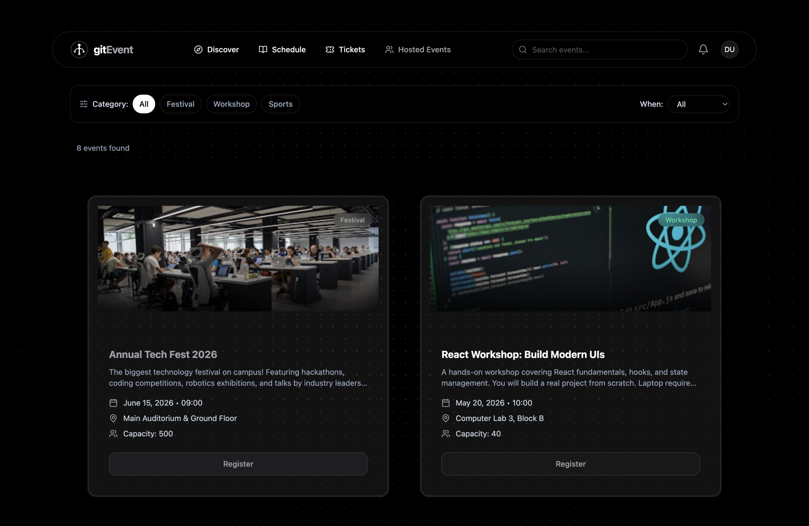
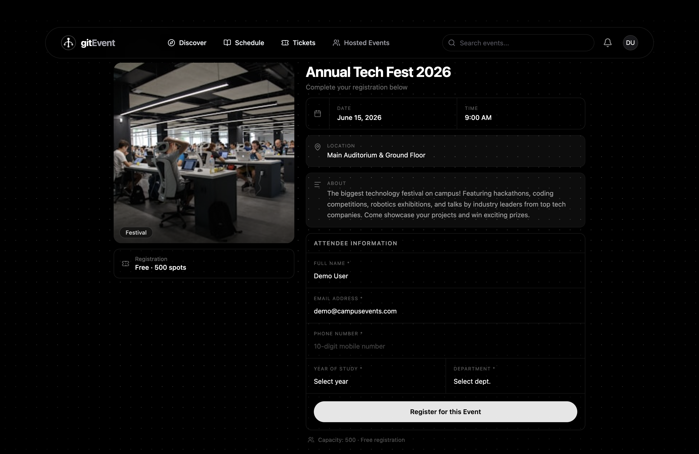
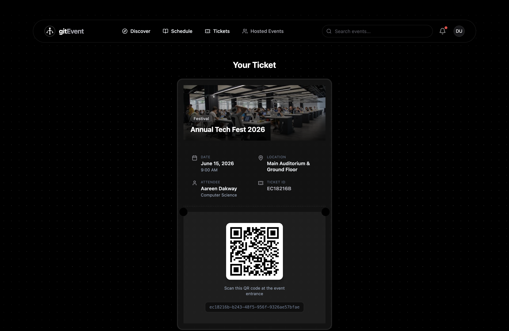

# Event Management and Ticketing Application

A modern, responsive React application built with Vite and Tailwind CSS for managing events, registering for them, and generating tickets.

## Overview

This is a comprehensive event management platform designed to streamline event discovery, registration, and ticketing. Users can browse upcoming events, register for their favorite events, and receive digital tickets for seamless event entry. The application features secure authentication, user dashboards for ticket and schedule management, and an admin panel for event creation and management.


## App Showcase

Here are some screenshots showcasing the main features and UI of the application:

| Home Page | Event Details | My Tickets |
|-----------|--------------|------------|
|  |  |  |

> _Tip: Place your screenshots in a `screenshots` folder at the root of your project. Update the file names above as needed._

## Key Features

- **Event Discovery**: Browse and search upcoming events on the home page with detailed event information
- **User Authentication**: Secure login and registration system with protected routes
- **Event Registration**: Register for events and instantly receive unique digital tickets
- **Digital Tickets**: View and manage generated tickets with QR code integration for seamless event entry
- **My Tickets Dashboard**: View all purchased and registered event tickets in one convenient location
- **My Schedule**: Keep track of all your registered events and their schedules
- **Admin Dashboard**: 
  - Create new events
  - Edit existing event details
  - Manage and update event information
- **Notifications**: Real-time toast notification system for user feedback and confirmations
- **User Profile**: Manage personal information and view user account details

## Tech Stack

| Technology | Purpose |
|-----------|---------|
| **React 19** | Frontend framework for building dynamic UI components |
| **Vite** | Fast build tool and development server |
| **React Router DOM v7** | Client-side routing and navigation |
| **Tailwind CSS** | Utility-first CSS framework for styling |
| **Lucide React** | Beautiful icon library |
| **qrcode.react** | QR code generation for digital tickets |
| **React Context API** | State management for authentication and notifications |
| **UUID** | Unique identifier generation |

## Installation & Setup

### Prerequisites

- Node.js (v18 or higher recommended)
- npm or yarn package manager

### Installation Steps

1. Clone the repository and navigate to the project folder:
   ```bash
   git clone <repository-url>
   cd reactjs_sem2-main
   ```

2. Install dependencies:
   ```bash
   npm install
   ```

3. Start the development server:
   ```bash
   npm run dev
   ```

4. Open your browser and visit `http://localhost:5173` (or the port provided in your terminal)

### Build Commands

- `npm run dev`: Starts the Vite development server with hot module replacement
- `npm run build`: Builds the app for production into the `dist` directory
- `npm run lint`: Runs ESLint to check for code quality and errors
- `npm run preview`: Previews the production build locally

## Usage Controls

- **Navigation**: Use the navbar to access Home, Events, My Tickets, My Schedule, and Admin sections
- **Event Discovery**: Browse events on the home page, filter by category, and view detailed event information
- **Registration**: Click on any event and fill out the registration form to secure your spot
- **Ticket Management**: Access your digital tickets from the "My Tickets" page and download QR codes
- **Schedule Tracking**: View all your registered events and their dates in the "My Schedule" section
- **Admin Access**: Create, edit, and manage events from the Admin dashboard (requires admin privileges)
- **User Profile**: Update your personal information and manage account settings from the Profile page

## Project Structure

```
src/
├── components/          # Reusable UI components
│   ├── blocks/         # Component blocks (sign-in flow, etc.)
│   └── ui/             # UI component library
├── context/            # React Context providers (Auth, Notifications)
├── pages/              # Application pages (Home, Events, Admin, etc.)
├── utils/              # Utility functions (date helpers, storage)
├── lib/                # Helper libraries and functions
├── App.jsx             # Root component and application routing
├── main.jsx            # React application entry point
└── index.css           # Global styles and Tailwind directives
```
